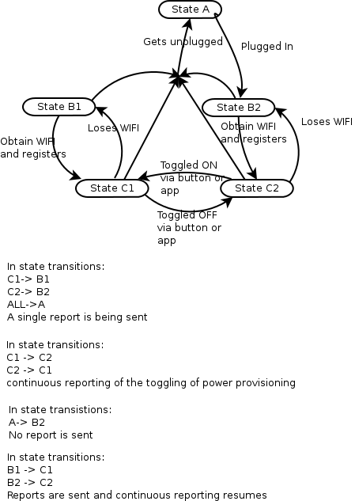

Introduction
============

This is a project holding all relevant code and data obtained during an investigation to the
wifiplug Android application protocol. The protocol has been named this way by me and is no way
official. All of the information and the resulting code is the result of reverse engineering and
as such it may very well have faults and misconceptions. It is well versed for evaluation and
research purposes but probably not ready to be used in production environments.

The wifiplug term is the property of wifiplug LTD

The project has grown organically from a Wireshark Lua Dissector for the V1 protocol, to an example client
for the Version 1 protocol.
Then support was added for scheduling state changes via a Google Calendar. Later on, Version 2 was released,
was reverse engineered and a Wireshark Lua Dissector was written for that one as well, and the client was updated.
Finally Version 3 (known as Wifiplug POWER) of the wifiplug protocol was released. That one did not need to be
reverse engineered since it's over HTTP and documentation for that one exists and is provided for free by Wifiplug
LTD. Support for Version 3 was added without a dissector being written

Brief explanation of the V1 protocol
====================================

The wifiplug Android application protocol was discovered and evaluated after some interest in the wifiplug
routine installation of the wifiplug Android application. This is the protocol used between
the various installations of the Android application around the world and a server. That specific
server is the one that talks with the plugs (that specific protocol has not been evaluated at all)
The Android application does _NOT_ talk directly with the plugs.

The protocol is encrypted using 3DES and two keys. There is a _master_ preshared key that is used to
encrypt the initiating parts of the conversation that is used to identify the user. Obtaining the
preshared key is trivial and left as an exercise to anyone feeling the need to obtain it. After user
authentication takes place (through standard username, password - the latter being MD5 hashed and
transmitted as that for some reason - procedure) a session key is obtained and used to encrypt the
rest of the conversation.

The server will periodically send status updates to the application. Those are not strictly status
updates since they will be sent anyway regardless of whether there has been any change in the state
of a plug. Those are encrypted always with the session key.

Commands can be sent by the application to the server asking changes to various attributes like the
state of a plug. Commands are always encrypted with the session key. It seems like the exception here is
the login/logout commands

Commands are (for some reason) enclosed in the strings 'BBBB' (presumably BEGIN) and 'EEEE' (presumably END) and are
identified by a single integer (1,2,3 etc). So for example 5 is the IDLE command, 1 is the LOGIN command etc
The server responds to these commands by sending the number corresponding to the sent command suffixed with
the string '+OK' and enclosed in the 'BBBB', 'EEEE' strings.

Brief explanation of the V2 protocol
====================================

The V2 protocol continues on the same spirit as the first version, however is way more compact, has builtin parity checks
is _NOT_ encrypted at all and has commands as bytes instead of using the 'BBBB' and 'EEEE' strings.

Brief explanation of the V3 protocol
====================================

The V3 protocol is clearly a complete rewrite. It's over HTTP and documentation is provided freely by wifiplug LTD.

States of a wifiplug
====================

A wifiplug may go through a number of states. These are explained in the following diagram. Please note that
this diagram is the result of reverse engineering and may well be inaccurate

Language
========

Lua. Why? Because it started as a PoC wireshark dissector and then a PoC client was
developped on top of it.

Explanation of the code
=======================

The project is split into 3 parts

Common code
-----------

The library of common functions, variables used by both the dissector and the client. This
resides in wifiplug\_common.lua. dumper.lua is being imported here for debugging purposes.

Wireshark dissector
-------------------

Residing in wifiplug.lua is the code used to have wireshark dissect successfully the processed
packets and display all the needed data

client application
------------------

The client application simulates a few very specific aspects of the Android application. Namely it
is capable of logging in (but not logging out!), parsing the status updates sent by the server and write
them to a CSV file and scheduling the toggling on/off of known plugs through a Google Calendar scheduler.
It's code resides in client.lua while also making use of ical.lua, dkjson.lua and two C extensions for Lua,
namely alarm and openssl. zlib.so was added later on

Libraries
---------

Libraries not written by me are ical.lua, dkjson.lua, dumper.lua and alarm and openssl. The copyright notices for
those have been kept intact. The two shared object libraries have binary objects redistributed for easy use. If any
issues arise from that redistribution I will remove them

How To Use
==========

Wireshark dissector
------------------

Just run wireshark in the directory you have the code with the -X parameter

	wireshark -X:wifiplug.lua mydump.dump

Where mydump.dump is a tcpdump/wireshark dump

	wireshark -X:wifiplug2.lua mydump.dump

For the second version

Client application
------------------

Make sure you use debian wheezy (7.x) or Ubuntu LTS 12.04 64-bit

* Install the prerequisites luasec and lua socket

For Debian Wheezy run with root privileges:

	apt-get install lua-socket lua-sec lua5.1

For Ubuntu LTS 12.04 with root privileges (sudo probably)

	apt-get install liblua5.1-sec1 liblua5.1-socket2 lua5.1

* Get the code

Either through git

	git clone repo_uri

or through the tar file

	tar xfvz wifiplug.tar.gz

* Configure it

Copy the dist file

	cp client_config.lua.dist client_config.lua.

Edit client\_config.lua and adjust the settings to match your own, then run run.sh

	./run.sh

For the Google Calendar
=======================

For the Google Calendar scheduling function,

* Write down the MACs of your plugs
* log in to Google Calendar
* create a new calendar
* make sure it has the same timezone as where you will be deploying the code
* create events with whatever names and scheduling you feel like and then add lines like the following in the description

For two MACs and respective states

	aabbccddeeff,ON
	112233445566,OFF

* Any lines not conforming to the above will be disregarded. _PLEASE DO NOT_ enter the same MAC twice. The last specified one is
bound to be the one happening so it _WILL_ confuse you.
* Go in to the calendars settings and copy paste the private link of the Calendar to the gcal\_url setting
* run run.sh

FAQ
===

* Q: shared objects (.so) in the repo ? Are you insane ?
* A: I wanted to have something working fast. alarm and openssl only existed in C extensions for Lua so I compiled them for
debian wheezy. They also work for Ubuntu 12.04.3 LTS. Feel free to recompile your own. Even better feel free to package them for
your favourite OS

* Q: Will the client be hitting the Google Calendar private link often ?
* A: Once every 60 seconds. It is locally cached and you can always adjust scheduler\_timer to something more to your liking

* Q: This is not a daemon!
* A: Yes I know, no plans to really daemonize the client

* Q: What does run.sh do?
* A: It provides an easy way to restart the application if it crashes. It is meant to be run in a screen command

* Q: How about the master 3DES key ?
* A: I wont be providing it publicly for security reasons. Feel free to discover it yourself though.

* Q: How about the server IP ?
* A: I wont be providing it publicly for security reasons. Feel free to discover it yourself though.

License
-------

All parts of the code and/or art that are not redistributed such as libraries are assumed to be under the license specified
in LICENSE file
